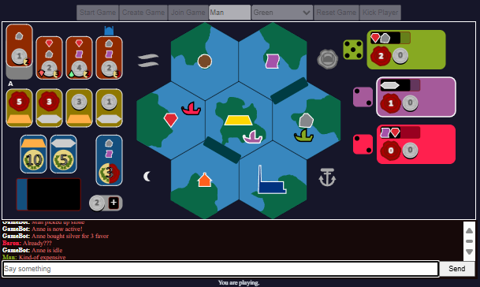

# Installation
Have `docker` and `docker-compose` installed

Run

```bash
make up
```


Web-based implementation of **Ophir** (Terra Nova Games)


## Description
Ophir is a highly-tactical pickup & deliver game for 2-4 players which takes place in a 7 island (zones) archipelago.

During the game, players move their ships across the archipelago, picking up and delivering cargo. Players gain coins by supplying goods to the market, which they can use to upgrade their ship cargo capacity and purchase precious metals to donate towards the temple construction. Metals are worth VP. The goal is to gather the most VP before the game ends.

Work in progress.

- The game is playable but has no lobby (a server supports only one session at a time).
- No db. Nothing is saved, nothing is safe.
- The game is missing "Specialists" (variable players powers).
- The interface language not yet standardized and missing quality of life features (incl. animations, transitions, tooltips, FTUE screens).

Try it out

## Setup and running
You can set up and run a server on your local network fairly easily.

1. Install [Node](https://nodejs.org/en/download/package-manager). You may also want to install [Chocolatey](https://docs.chocolatey.org/en-us/chocolatey-components-dependencies-and-support-lifecycle/#supported-windows-versions) for a better setup experience. If you have it, then open a terminal and run `choco install make`.

2. Download the project (codebase) and enter the root folder (*ophir-2d*).

3. Create an `.env` file (just '.env') next to `.env.example` and copy its content into it. You should replace the SERVER_ADDRESS value with your local IPv4 address (find it in your Ethernet settings). Other computers on the local network can't access 'localhost'.

4. Open a terminal in the root folder -- all commands should be run there.

 - Run `make install` to download dependencies, bundle the code and start the server.

Alternatively, follow these steps:
 - Create a folder named *public*.
 - Copy `index.html` and `style.css` from *src/client/layout/* into the newly created *public* folder.
 - Run `npm install`.
 - Run `npm run build_server`.
 - Run `npm run build_client`.
 - Run `node public/server.cjs`.

Share the server address to play on your network. If you want to open multiple clients on the same machine, make sure each runs on a different browser or incognito window. The sessionStorage is being used to identify each client and resume the connection in case of page refresh.

To shut down the server gracefully, input `shutdown` in the running server's command line interface (CLI).
You can also shut it down remotely by making a regular http request to "http://<SERVER_ADDRESS>:<HTTP_PORT>/shutdown?auth=<SHUTDOWN_AUTH>". Use the values in your .env file.

To start the server again run `make run` or `node public/server.cjs`.

## Troubleshooting
If you experience mouseover issues try using an alternative browser.
If the client tab gets stuck, clear the browser's Session Storage record for the URL or restart the browser.
If the server session gets stuck, input `reset` in the running server's CLI.

## How to play

 Any page visitor may become the Session Owner by clicking Create Game. Once the game session has been created, the remaining visitors may click on Join Game. All players must first select a player color before creating/joining. The name is optional. Only Players (up to 4) can use the built-in chat. There can be any number of spectators.

 Once there are at least 2 players the Session Owner may click the Start Game button to complete the setup and begin playing. The Session Owner also has the ability to Reset the game at any time (revert to a new open session without players).

 On the board, players are identified by their Ship Figure (on the map center zone) and the Player Card (on the right side of the screen), both displayed in their chosen color. Player Cards are arranged from top to bottom, signifying the turn order. Your Player Card appears first and is wider than the rest. The three placards on the left display information and actions available at the Market, Exchange, and Temple locations on the map.

 On your turn you will move and get to perform available Actions at your destination by clicking on elements. Interactive elements are generally depicted as cards or icons. Your cursor will turn into a pointer when hovering over them if they're available or into a restricted icon if they're not available. When done you will have to end your turn by clicking on the green anchor icon (lower right of the map). The next player will be able to take his or her turn immediately after.

 With two players, a third ship is added. Players can move it during their turn when they enter its zone.   

 There's decent amount of rules to Ophir. Refer to the included RULES.md document for details. You can also play by following your intuition (the rules are enforced, you can't cheat).
