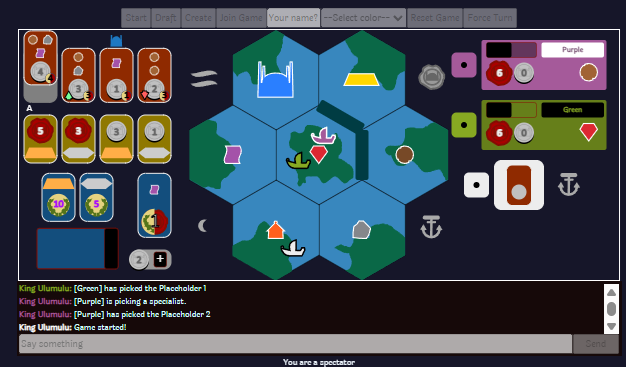

Web-based implementation of **Ophir** (Terra Nova Games)

## Description
Ophir is a highly tactical pickup & deliver game for 2-4 players which takes place in a 7-island (zones) archipelago.

During the game, you will sail across the archipelago, picking up commodities and precious metals and supplying them to the market or temple. The game features two types of currency: coins and favor. Coins help you increase your cargo capacity, while favor enables certain privileges during your turn. Both are good for purchasing gold and silver. These precious metals are worth victory points (VP). The goal is to gather the most VP before the game ends.

Work in progress.

- Performance optimizations may still be needed.
- The interface language is not yet standardized and is missing quality of life features (more utility animations, transitions, tooltips, FTUE screens).
- The game is fully playable on a local network. I haven't tested deployments yet.
- There is a planned 'lobby' page for viewing and joining sessions. You currently have to check the database to see what's avaialable, LOL.

Try it out

## Setup and running
You can set up and run a server fairly easily on your local network.

0. Take a deep breath.

1. Install [Node](https://nodejs.org/en/download/package-manager).
   - You may then also install **Make** for a straightforward experience.
      - First, install the [Chocolatey](https://docs.chocolatey.org/en-us/chocolatey-components-dependencies-and-support-lifecycle/#supported-windows-versions) package manager.
      - Then, open a command tool (i.e., Powershell) and run `choco install make`.
      - Finally, if on **Windows**, install [Git Bash](https://gitforwindows.org/) (it's bundled w/ Git for Windows).

2. Download the project:
   - If you have Git, run `git clone https://github.com/generalustelaru/ophir-2d.git` (You can use Git Bash for this).
   - Alternatively, get the zip file [here](https://github.com/generalustelaru/ophir-2d/archive/refs/heads/main.zip) and extract it.

3. Install the project:
   - Enter the project folder, *\ophir-2d* (use **Bash** or **Git Bash** to run `make` commands)
   - Run `make install` to have the server set up and ready.
   - If that doesn't work for you, follow these steps:
      - Create the folder structure named *dist/public* in the root folder.
      - Copy the contents of *src/client/static/* into the newly created *public* folder.
      - Create a copy of *.env.example* and rename it as *.env*.
      - Replace the SERVER_ADDRESS value in .env with your local Ethernet address. How to obtain it:
          - PowerShell: `Get-NetIPAddress -AddressFamily IPv4 | Where-Object {$_.InterfaceAlias -like '*Ethernet*'}`
          - Git bash: `ipconfig | grep -A 3 'Ethernet' | grep 'IPv4' | awk '{print $NF}'`
          - Linux: `hostname -I`
      - Create file `db.json` and copy this content into it: `{\"sessions\": [], \"config\":{}}`.
      - Run `npm ci && npm run build_server && npm run build_client`.

4. Start json-server: Run `make db` or `npx json-server --watch db.json`. (This is a stand-in for a database).

5. Start the game server: Open a new CLI window and run `make run` or `node public/server.cjs`.

6. Copy the server address and open it in a browser.

Click on a ship card to become the session owner. Then copy the URL address and share it with your local network firends for them to connect to your session. If you want to open multiple clients on the same machine, ensure that each one runs on a different browser or incognito window. The browser storage holds your player identity, so two or more tabs on the same browser will mirror the same user.

To shut down the server gracefully, type `shutdown` in the server command-line interface (CLI).
You can also shut it down remotely by making a regular HTTP request to "http://<SERVER_ADDRESS>:<HTTP_PORT>/shutdown?auth=<ADMIN_AUTH>". Use the values in your .env file.

## Troubleshooting
If you experience mouseover or click issues, try using an alternative browser (Chrome, Firefox, and Edge should work).
If your client gets stuck, try refreshing the tab.
If that doesn't work, replace the UUID in your adress bar with `/new` and press Enter to start a fresh session.

## How to play
Any page visitor may enrol in the game session by selecting a color card. Visitors who've chosen a color (up to four) can begin using the built-in chat. There can be any number of spectators.

 There's a decent number of rules in Ophir. To learn how to play, you can:
 - Watch this [how-to-play video](https://youtu.be/pJrDOh6HadI?si=ZOGegm3W-7GWgNP1) from the Dice Tower YouTube channel.
 - Examine the included [RULES.md](https://github.com/generalustelaru/ophir-2d/blob/main/RULES.md) document.
 - Follow your intuition. The game rules are enforced. You can't cheat but you can certainly make mistakes.

## Debug options (fun stuff)
You can edit the "config" values found in `db.json`. The values will only be applied after resetting the game or starting a new one.

`SERVER_NAME`: The name that appears in chat for server messages.

`ADMIN_AUTH`: The 'auth' URL parameter value for the GET request to /shutdown.

`IDLE_CHECKS`: Enables other players to force-end the turn of the current player if idle.

`IDLE_TIMEOUT`: Time of perceived inactivity (in minutes) for the current player before receiving the idle status.

`SINGLE_PLAYER`: Allows session to start with a single enrolled player.

`NO_RIVAL`: Skips including the rival ship and its rules in 2-player games (and solo if SINGLE_PLAYER is enabled).

`RICH_PLAYERS`: Players start with 99 coins.

`FAVORED_PLAYERS`: Players start with maximum favor (6).

`CARGO_BONUS`: Players start with cargo advantages.
   - values: 0 (No bonus), 1 (Upgraded cargo), 2 (One of each commodity onboard), 3 (One gold and one silver onboard)

`SHORT_GAME`: Reduces the Temple Track to a single column (the game ends after three metal donations).

`INCLUDE`: Ensures selected specialists appear in the draft (from first to last, up to the amount required for the player count).
   - Values: ambassador, harbormaster, moneychanger, priest, temple_guard, postmaster, navigator, advisor, chancellor, peddler
   - Format: `["<value>"]`, `["<value>","<value>"]`, etc.